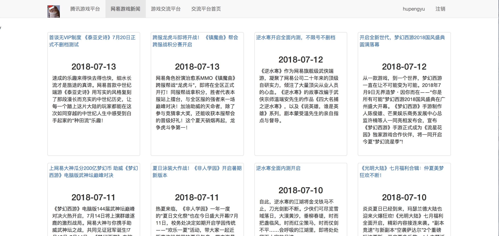
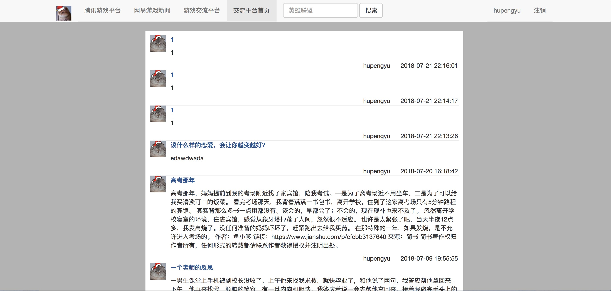

### game_news - 聚合游戏新闻阅读


`game_news`是一个聚合腾讯游戏新闻、网易游戏新闻的阅读平台，并提供了一个简易的交流平台。`game_news`的目的是为了让游戏爱好者更加方便、详细了解国内两大游戏运营商的最新游戏相关信息。

### Overview

`game_news`的所有新闻相关数据都是用爬虫爬取的，然后存入MySQL数据库，再通过Flask框架将其展现在前端。对于腾讯、网易新闻首页上不同页面规则的最新最热新闻，我将代码解析后再统一展示出来，这样方便阅读，而不是仅仅跳转到对应网站就完善，简洁快速的阅读体验是最重要的。

`game_news`还提供了一个简单的交流平台，在这个平台上既可以发表自己的一些问题或者想法，也可以查阅别人的文章并参与评论。

我在用户登录过程中使用了MySQL储存了用户的基本信息，如用户名，账号以及加密后的密码。

##### Installation

请先安装好MySQL，`game_news`使用`pipenv`管理虚拟环境,比如我创建的环境路径是`/User/morgan/annaconda/annaconda3/envs/python39/bin/python3.6`，然后安装好pipenv后，进入项目目录。依照步骤进行。

```
# 下载代码
git clone https：//github.con/morgan12580/game_news
cd game_news
pip install pipenv
pipenv install --pyton /Users/howei/anaconda/anaconda3/envs/python39/bin/python3.6
# 进入虚拟环境
pipenv shell

#直接下载镜像
dicker pull morgan12580/game_news

```

##### Features

* 新闻数据丰富（包含数字新闻、图片新闻、视频新闻以及各种模式游戏的最新资讯）
* 新闻来源真实（腾讯游戏新闻、网易游戏新闻）
* 新闻页面统一解析
* 完善的阅读体验
* 搜索
* 交流平台（用户发表问答、评论）
* 注册（开放注册）

#### Screenshots

下面是一些截图展示。

首页/腾讯游戏新闻:


网易游戏新闻：



新闻详情：


游戏交流平台：


交流平台首页：




